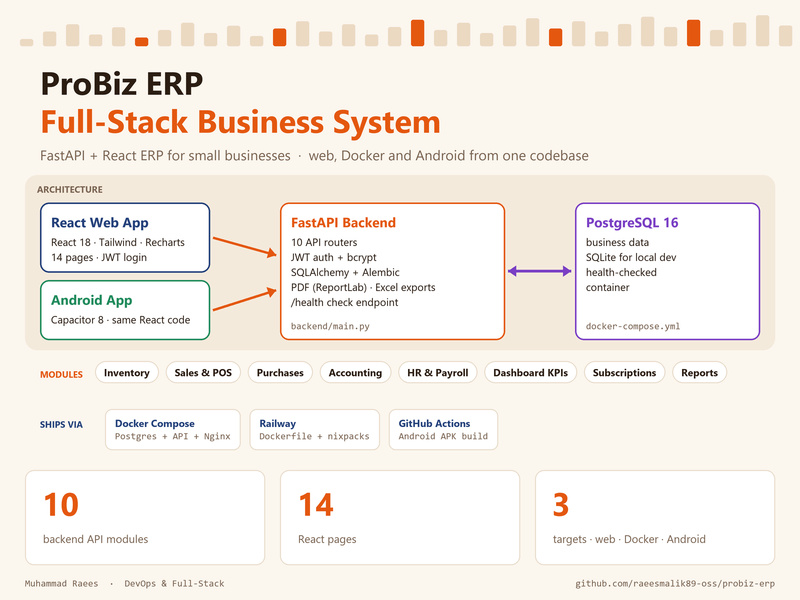

# ProBiz ERP



A full-stack ERP for small businesses: inventory, sales & POS, purchases, accounting,
HR & payroll, subscriptions and a KPI dashboard. One codebase runs as a web app,
in Docker, and as an Android app.

## Tech stack

| Layer | Technology |
|-------|------------|
| Backend | Python 3.11, FastAPI, SQLAlchemy, Alembic, JWT (python-jose) + bcrypt, ReportLab (PDF), openpyxl (Excel) |
| Database | PostgreSQL 16 (Docker / production), SQLite (local development) |
| Frontend | React 18, React Router, Tailwind CSS 3, Recharts, Axios |
| Mobile | Capacitor 8 (Android) |
| DevOps | Docker, Docker Compose, Railway, Render, Vercel, GitHub Actions (Android APK build) |

## Modules

| Module | Backend router |
|--------|----------------|
| Authentication & roles | `routers/auth.py`, `routers/admin.py` |
| Inventory (products, categories, stock alerts) | `routers/inventory.py` |
| Sales & POS (invoices, customers, payments) | `routers/sales.py` |
| Purchases (purchase orders, suppliers) | `routers/purchases.py` |
| Accounting (chart of accounts, transactions, P&L) | `routers/accounting.py` |
| HR & Payroll (employees, attendance, payslips) | `routers/payroll.py` |
| Dashboard KPIs | `routers/dashboard.py` |
| Subscriptions & demo requests | `routers/subscription.py`, `routers/demo_requests.py` |

## Run with Docker (recommended)

```bash
cp .env.example .env        # then set POSTGRES_PASSWORD and SECRET_KEY
docker compose up -d --build
docker compose logs backend # first start prints the admin login
```

- App: http://localhost
- API: http://localhost:8000 (health check: `/health`)

## Run locally without Docker

Backend (uses SQLite by default):

```bash
cd backend
cp .env.example .env        # set SECRET_KEY
pip install -r requirements.txt
python seed.py              # prints the admin login once
uvicorn main:app --reload --port 8000
```

Frontend:

```bash
cd frontend
npm install
npm start                   # http://localhost:3000
```

On Windows you can also double-click `start-backend.bat` and `start-frontend.bat`,
or `start-local-network.bat` to share the app with other PCs on your network.

## Login accounts

`seed.py` creates an admin, a manager and a cashier on first run.

- Admin email: `SEED_ADMIN_EMAIL` (default `admin@probiz.pk`)
- Passwords: `SEED_ADMIN_PASSWORD` and `SEED_DEMO_PASSWORD`. If they are not set,
  random passwords are generated and printed once in the backend log.

## Android app

The **Build Android APK** workflow (`.github/workflows/build-apk.yml`) builds a debug APK
on every push that changes `frontend/`. Download it from the workflow run's **Artifacts**.
Set the repository variable `REACT_APP_API_URL` to point the app at your backend.

## Deployment

| Target | Config |
|--------|--------|
| Railway | `backend/railway.toml`, `frontend/railway.toml` |
| Render (backend + PostgreSQL) | `render.yaml` |
| Vercel (frontend) | `vercel.json` |

## Project structure

```text
probiz-erp/
├── .github/workflows/build-apk.yml   # Android APK CI
├── backend/                          # FastAPI app, models, routers, seed
├── frontend/                         # React app + Capacitor Android project
├── docs/                             # user manual, technical guide, diagram
├── docker-compose.yml
├── .env.example
├── render.yaml · vercel.json
└── start-*.bat                       # Windows helpers
```

## Author

**Muhammad Raees**, DevOps & Full-Stack Engineer
[GitHub](https://github.com/raeesmalik89-oss) · [LinkedIn](https://linkedin.com/in/muhammad-raees081489)
